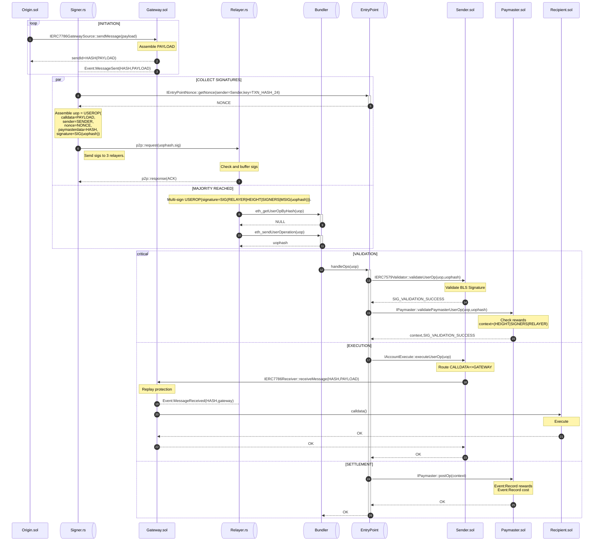

# UCCB

The purpose of UCCB is to function as a generic bridge that can be used to make remote calls across chains/networks.

## Sequence Diagram

```mermaid
sequenceDiagram
autonumber
participant Origin.sol
participant Signer.rs@{ "type" : "queue" }
participant Gateway.sol
participant Relayer.rs@{ "type" : "queue" }
participant Bundler@{ "type" : "queue" }
participant EntryPoint@{ "type" : "queue" }
participant Sender.sol
participant Paymaster.sol
participant Recipient.sol

loop INITIATION
Origin.sol->>Gateway.sol:IERC7786GatewaySource::sendMessage(payload)
Note over Gateway.sol:Assemble PAYLOAD
Gateway.sol-->>Origin.sol:sendId=HASH(PAYLOAD)
Gateway.sol-->Signer.rs:Event:MessageSent(HASH,PAYLOAD)
end

par COLLECT SIGNATURES
Signer.rs->>+EntryPoint:IEntryPointNonce::getNonce(sender=Sender,key=TXN_HASH_24)
EntryPoint-->>-Signer.rs:NONCE
Note over Signer.rs:Assemble uop = USEROP(<br/>calldata=PAYLOAD,<br/>sender=SENDER,<br/>nonce=NONCE,<br/>paymasterdata=HASH,<br/>signature=SIG(uophash))
Signer.rs->>Relayer.rs:p2p::request(uophash,sig)
Note right of Signer.rs:Send sigs to 3 relayers.
Note over Relayer.rs:Check and buffer sigs
Relayer.rs-->>Signer.rs:p2p::response(ACK)

and MAJORITY REACHED
Note over Relayer.rs:Multi-sign USEROP(signature=SIG(RELAYER|HEIGHT|SIGNERS|MSIG(uophash))).
Relayer.rs->>+Bundler:eth_getUserOpByHash(uop)
Bundler-->>-Relayer.rs:NULL
Relayer.rs->>+Bundler:eth_sendUserOperation(uop)
Bundler-->>-Relayer.rs:uophash
end

critical VALIDATION
Bundler->>+EntryPoint:handleOps(uop)
EntryPoint->>Sender.sol:IERC7579Validator::validateUserOp(uop,uophash)
Note over Sender.sol:Validate BLS Signature
Sender.sol-->>EntryPoint:SIG_VALIDATION_SUCCESS

EntryPoint->>Paymaster.sol:IPaymaster::validatePaymasterUserOp(uop,uophash)
Note over Paymaster.sol:Check rewards<br/>context=(HEIGHT|SIGNERS|RELAYER)
Paymaster.sol-->>EntryPoint:context,SIG_VALIDATION_SUCCESS

option EXECUTION

EntryPoint->>Sender.sol:IAccountExecute::executeUserOp(uop)
Note over Sender.sol:Route CALLDATA=>GATEWAY
Sender.sol->>Gateway.sol:IERC7786Receiver::receiveMessage(HASH,PAYLOAD)

Note over Gateway.sol:Replay protection
Gateway.sol-->Relayer.rs:Event:MessageReceived(HASH,gateway)

Gateway.sol->>Recipient.sol:calldata()
Note over Recipient.sol:Execute
Recipient.sol-->>Gateway.sol:OK
Gateway.sol-->>Sender.sol:OK
Sender.sol-->>EntryPoint:OK

option SETTLEMENT
EntryPoint->>Paymaster.sol:IPaymaster::postOp(context)
Note over Paymaster.sol:Event:Record rewards<br/>Event:Record cost
Paymaster.sol-->>EntryPoint:OK
EntryPoint-->>-Bundler:OK
end
```
