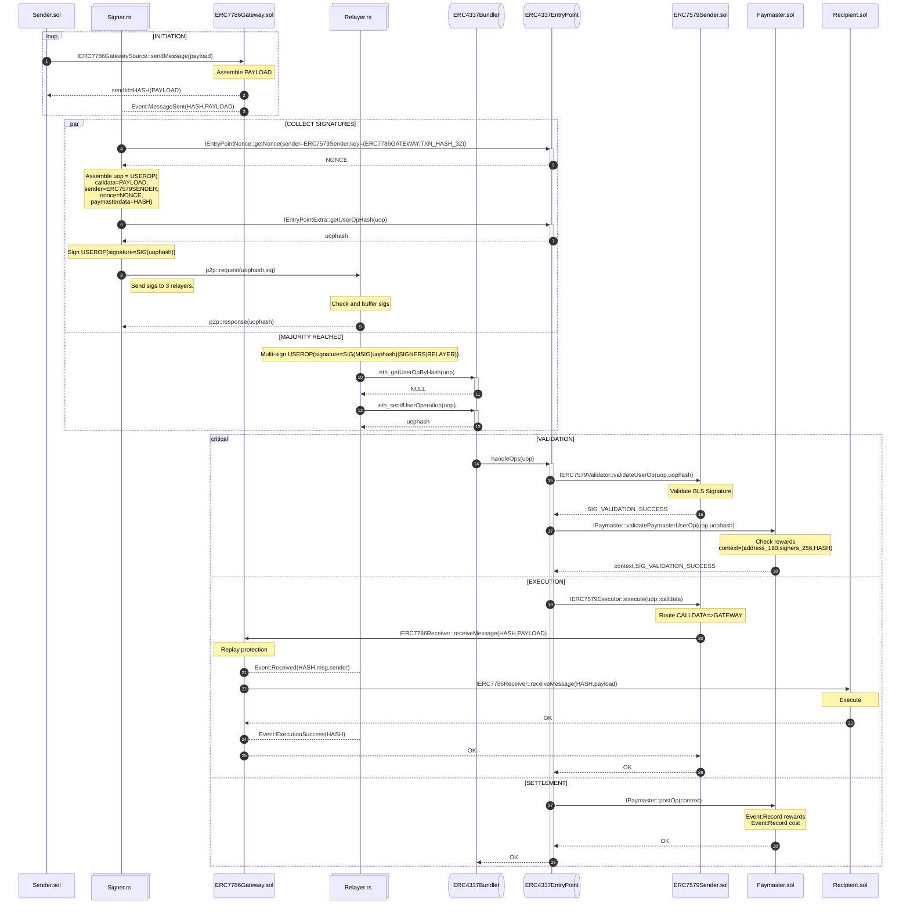

```mermaid
sequenceDiagram
autonumber
participant Sender.sol
participant Signer.rs@{ "type" : "collections" }
participant ERC7786Gateway.sol
participant Relayer.rs@{ "type" : "collections" }
participant ERC4337Bundler@{ "type" : "queue" }
participant ERC4337EntryPoint@{ "type" : "queue" }
participant ERC7579Sender.sol
participant Paymaster.sol
participant Recipient.sol

loop INITIATION
Sender.sol->>ERC7786Gateway.sol:IERC7786GatewaySource::sendMessage(payload)
Note over ERC7786Gateway.sol:Assemble PAYLOAD
ERC7786Gateway.sol-->>Sender.sol:sendId=HASH(PAYLOAD)
ERC7786Gateway.sol-->Signer.rs:Event:MessageSent(HASH,PAYLOAD)
end

par COLLECT SIGNATURES
Signer.rs->>+ERC4337EntryPoint:IEntryPointNonce::getNonce(sender=ERC7579Sender,key=(ERC7786GATEWAY,TXN_HASH_32))
ERC4337EntryPoint-->>-Signer.rs:NONCE
Note over Signer.rs:Assemble uop = USEROP(<br/>calldata=PAYLOAD,<br/>sender=ERC7579SENDER,<br/>nonce=NONCE,<br/>paymasterdata=HASH)
Signer.rs->>+ERC4337EntryPoint:IEntryPointExtra::getUserOpHash(uop)
ERC4337EntryPoint-->>-Signer.rs:uophash
Note over Signer.rs:Sign USEROP(signature=SIG(uophash))
Signer.rs->>Relayer.rs:p2p::request(uophash,sig)
Note right of Signer.rs:Send sigs to 3 relayers.
Note over Relayer.rs:Check and buffer sigs
Relayer.rs-->>Signer.rs:p2p::response(uophash)

and MAJORITY REACHED
Note over Relayer.rs:Multi-sign USEROP(signature=SIG(MSIG(uophash)|SIGNERS|RELAYER)).
Relayer.rs->>+ERC4337Bundler:eth_getUserOpByHash(uop)
ERC4337Bundler-->>-Relayer.rs:NULL
Relayer.rs->>+ERC4337Bundler:eth_sendUserOperation(uop)

ERC4337Bundler-->>-Relayer.rs:uophash
end

critical VALIDATION
ERC4337Bundler->>+ERC4337EntryPoint:handleOps(uop)
ERC4337EntryPoint->>ERC7579Sender.sol:IERC7579Validator::validateUserOp(uop,uophash)
Note over ERC7579Sender.sol:Validate BLS Signature
ERC7579Sender.sol-->>ERC4337EntryPoint:SIG_VALIDATION_SUCCESS

ERC4337EntryPoint->>Paymaster.sol:IPaymaster::validatePaymasterUserOp(uop,uophash)
Note over Paymaster.sol:Check rewards<br/>context=(address_160,signers_256,HASH)
Paymaster.sol-->>ERC4337EntryPoint:context,SIG_VALIDATION_SUCCESS

option EXECUTION

ERC4337EntryPoint->>ERC7579Sender.sol:IERC7579Executor::execute(uop::calldata)
Note over ERC7579Sender.sol:Route CALLDATA=>GATEWAY
ERC7579Sender.sol->>ERC7786Gateway.sol:IERC7786Receiver::receiveMessage(HASH,PAYLOAD)

Note over ERC7786Gateway.sol:Replay protection
ERC7786Gateway.sol-->Relayer.rs:Event:Received(HASH,msg.sender)

ERC7786Gateway.sol->>Recipient.sol:IERC7786Receiver::receiveMessage(HASH,payload)
Note over Recipient.sol:Execute
Recipient.sol-->>ERC7786Gateway.sol:OK
ERC7786Gateway.sol-->Relayer.rs:Event:ExecutionSuccess(HASH)

ERC7786Gateway.sol-->>ERC7579Sender.sol:OK
ERC7579Sender.sol-->>ERC4337EntryPoint:OK

option SETTLEMENT
ERC4337EntryPoint->>Paymaster.sol:IPaymaster::postOp(context)
Note over Paymaster.sol:Event:Record rewards<br/>Event:Record cost
Paymaster.sol-->>ERC4337EntryPoint:OK
ERC4337EntryPoint-->>-ERC4337Bundler:OK
end
```
